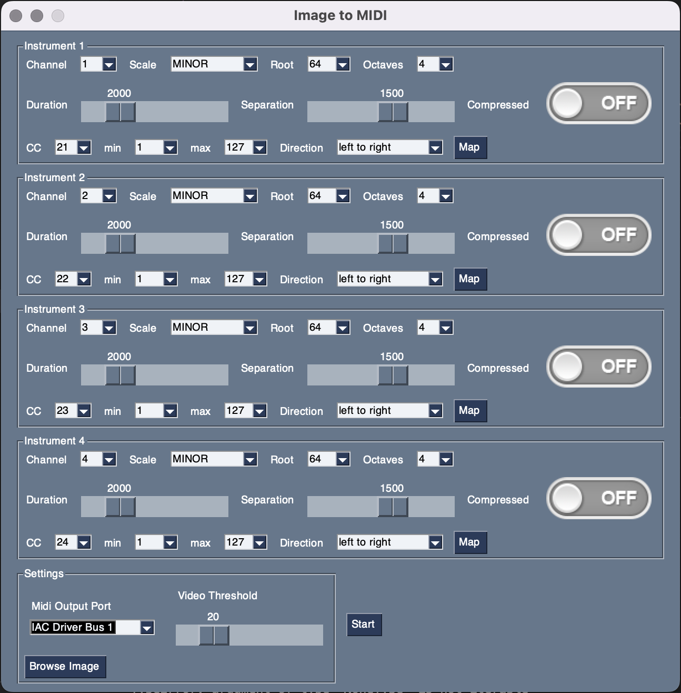

# Image to Midi
Python package to convert image to Midi. It takes as an input an image and interpretes it as a probability distribution (gray scale based), considering the X axis a series of the selected notes and the Y axis the velocity.
Separation controls the sampling frequency from a Normaldistribution from the learned probability distribution and the Duration controls the note duration from another Normal propability distribution.

TODO



## Install
Tested on Python 3.7
```
pip install -r requirements.txt
python image_to_midi.py
```

To it with your DAW:
- Create a virtual MIDI channel:
  - for MacOS: Create new MIDI Bus Channel using the MIDI Studio: cmnd + space - type Audio MIDI Setup - Click on Window - Show MIDI Studio

  - For Windows download [LoopMIDI](https://www.tobias-erichsen.de/software/loopmidi.html) install it and create a new MIDI Channel
- In your DAW select the BUS with Track and Remote options activated


## Compile UI

```
pyinstaller image_to_midi.py --onefile --noconfirm --windowed --hidden-import=mido,cv2.cv2 --paths=classes --add-data="model/MobileNetSSD_deploy.prototxt:model" --add-data="model/MobileNetSSD_deploy.caffemodel:model"
```

For Windows you will need the Visual Studio Developer Tools C++ 14
make sure you have python 3.7 and pyinstaller on the PATH environment variables.